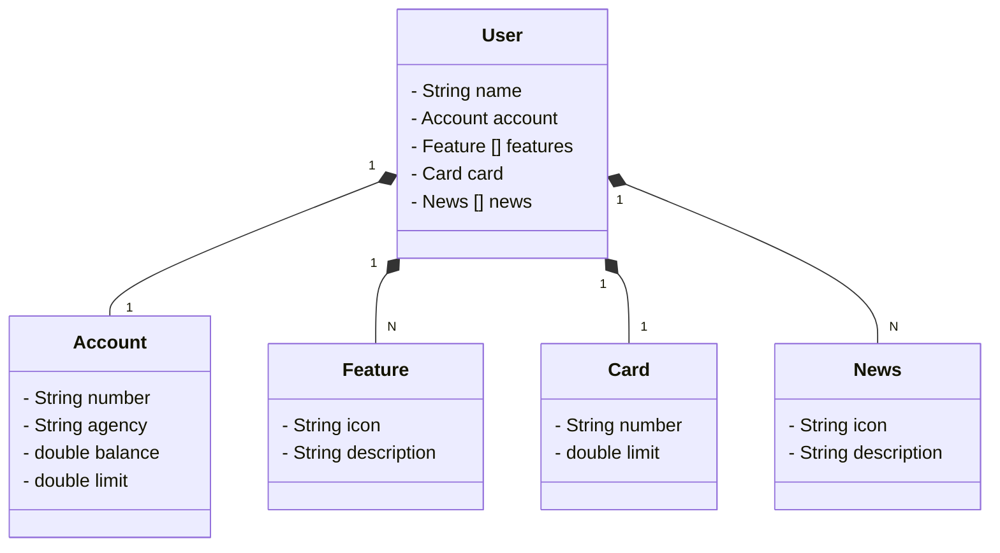

# Santander Dev Week - 2025
Java RESTfuk API criada para o Santander Dev Week.

## Diagrama de Classes

# 💻 **Santander Dev Week**

[DIO](https://www.dio.me/)

**Autrores:**

[Jéssica Fernandes](https://github.com/Jessica-SFernandes)

# 

## Descrição

Projeto reproduzido com o auxilio do professor [Venilton FalvoJr](https://github.com/falvojr), realizado na aula Santander DEV Week.

## Tecnologias Utilizadas

    

